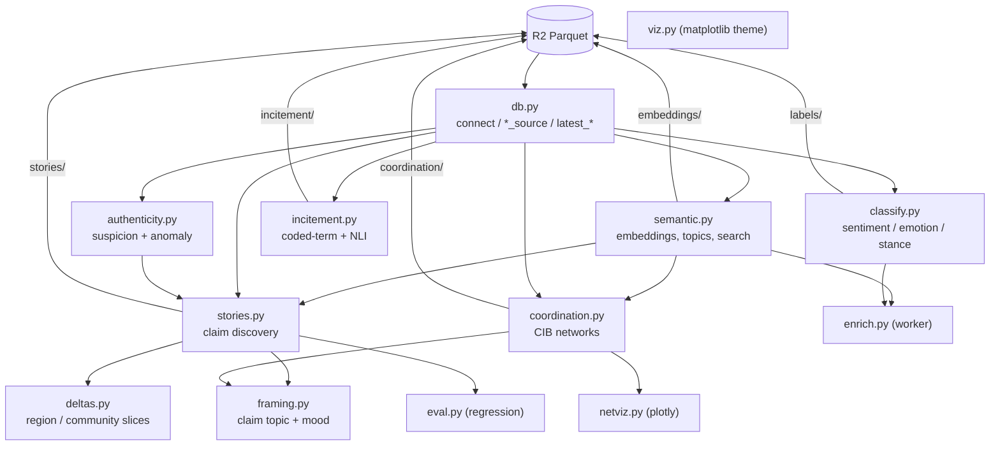

# Code map: the `kma` package

How the analysis code is organised and how data flows through it. Pairs with
the [data model](data-model.md) (what the bytes are) and the phase design docs
(why each method exists). Source lives in `analysis/src/kma/`.

`kma` is one editable package. Every module takes a DuckDB connection from
`db.connect()` (or `db.connect_quack()`) and either returns a DataFrame/relation
or writes a Parquet run back to R2. Nothing holds long-lived state; a notebook
or script wires the modules together.

## Data flow

## Modules

### Foundation

- **`db.py`** - the only thing that talks to R2. `connect()` (local DuckDB +
  R2 secret) and `connect_quack()` (remote tf1 server). For each prefix a
  `<name>_source()` returns a `read_parquet(...)` glob for SQL `FROM`, and a
  `latest_<name>()` returns the deduped relation. Start here to understand any
  query.
- **`viz.py`** - shared matplotlib theme + chart primitives (`use_theme`,
  `use_theme_538`, `altair_theme_538`, `hbars`, `grouped_hbars`,
  `diverging_stack`). Encodes the validated palette so every notebook reads as
  one system. Text wears ink tokens, marks wear series colour.

### Phase 1 - authenticity

- **`authenticity.py`** - account-level triage. `author_features` builds the
  feature frame; `heuristic_score` is a transparent weighted `suspicion`
  (followers/following ratio, account age, tweet rate, duplicate-text ratio,
  empty bio, default avatar, handle digits); `authenticity_score` adds an
  unsupervised IsolationForest `anomaly_score`. A suspicion score is a triage
  signal, **not** a bot label.

### Phase 2 - semantic / narrative

- **`semantic.py`** - the embedding layer. `embed_new` encodes unembedded posts
  and writes `embeddings/` (incremental); `search` is cosine semantic search;
  `assign_topics` (UMAP + HDBSCAN) and `topic_summary` build the corpus topic
  landscape. 768-d multilingual vectors.
- **`classify.py`** - transformer inference. `classify_new` persists
  sentiment + emotion to `labels/` (incremental); `stance(con, target)` is
  zero-shot supports/opposes/neutral, computed live. `_pipe`/`_run` are the
  OOM-safe batching helpers reused by `incitement.py`.
- **`enrich.py`** - the recurring worker that keeps `embeddings/` and `labels/`
  current with the always-on collector. Loops bounded incremental passes then
  idles. Console script `kma-enrich`; isolate mode runs embed and classify as
  separate subprocesses so the transformer models never coexist (RAM guard).

### Phase 3 - coordination (CIB)

- **`coordination.py`** - the largest module. Builds behavioural `traces`
  (co-retweet / co-reply / text-sim / fast-co-share / co-hashtag / co-url /
  co-mention), projects them to weighted account-account edges, validates edges
  against a degree-corrected null (`validate_svn`, plus curveball and
  Monte-Carlo cross-checks), builds a multiplex graph, and finds Leiden
  communities (`build_layers` -> `clusters`). `scorecards` characterises
  clusters; `persist_edges`/`persist_clusters` write `coordination/`.
  Claim-scoped views (`story_account_set`, `claim_coordination`) filter to one
  claim's accounts. Synthetic-injection eval lives here too
  (`inject_synthetic`, `evaluate_recovery`).
- **`netviz.py`** - interactive plotly graph of the coordination network
  (hover carries full triage context). `viz`'s static graph is the print twin.

### Phase 4 - stories / claims

- **`stories.py`** - claim discovery. `candidate_stories` clusters recent post
  embeddings into near-duplicate "stories" (a claim = a story), rejecting
  chaining blobs and low-information posts; `assign_tiers` splits main vs
  thin-evidence lanes; `corroboration` checks trusted-media/fact-checker
  coverage (PesaCheck, AfricaCheck); `origin`/`spread` give first-mover and
  amplifier views; `stable_story_id` is the durable content hash;
  `persist_stories` writes `stories/`.
- **`framing.py`** - maps one claim onto the corpus topic landscape and
  summarises its sentiment timeline (`story_topics`, `story_keywords`,
  `sentiment_timeline`, `story_framing`). Corpus-wide topics, claim-local mood.
- **`deltas.py`** - region and (experimental) ethnic-community aggregates of a
  claim's authors from free-text profile `location`. **Aggregate-only**, gated
  by `MIN_LOCATION_COVERAGE`, always carrying `TRIBE_DISCLAIMER`. The community
  proxy conflates geography with ethnicity and is wrong for any individual; it
  is never a headline metric.
- **`eval.py`** - ground-truth regression harness. Encodes known
  fabricated/distorted stories and walks each through the pipeline
  (presence -> embedding -> clustering -> scoring), reporting where it drops
  out. Turns green on a good fix, red on a recall regression.

### Ethnic-incitement lens (added by the 2026-07 sweep)

- **`incitement.py`** - two independent triage signals. `lexicon_scan` regexes
  documented coded terms (NCIC / PeaceTech-sourced: madoadoa, kwekwe, nyoka,
  ...), each entry tagged with a false-positive risk. `score_new` runs zero-shot
  NLI (dehumanisation / violence-call / othering, plus an ordinary-political-
  criticism contrast class) and persists to `incitement/`, prioritising
  lexicon hits. Used with a **joint rule** (lexicon hit AND high NLI): NLI
  alone over-triggers on ethnic-bloc horse-race commentary. Design notes and
  the validation set are in the investigation folder below.

## Notebooks (`analysis/notebooks/`)

Each is a marimo app that runs end-to-end against live R2 and layers a UI over
the modules above.

| Notebook | Surface |
|---|---|
| `explore.py` | corpus volume / general exploration |
| `authenticity.py` | suspicion distributions + feature breakdowns |
| `narratives.py` | topics, sentiment/emotion, stance, region/community slices |
| `coordination.py` | CIB method lab: channels, validation, injection-recovery eval |
| `stories.py` | claim discovery method lab: tiers, origin/spread |
| `desk_brief.py` | investigator composition (claims + all lenses per claim) |
| `manipulation.py` | 2026-07 sweep results (538-styled Altair panels over the `out/` artifacts) |

marimo gotcha: a cell's output is its last *top-level* expression; bind a figure
to `_out` and end the cell with `_out` rather than leaving it inside an
`if/else`.

## Investigations (`analysis/investigations/`)

Dated, self-contained analysis campaigns. Each folder holds numbered standalone
scripts (`uv run python NN_*.py`, `--sample` first then `--full`), a local
`out/` of artifacts (CSVs committed, large parquet gitignored), and a
hand-written `findings.md`. The 2026-07 sweep
(`2026-07-17-manipulation-sweep/`) is the reference example: temporal
fingerprints, birth cohorts, copypasta forensics, reply brigading, velocity
anomalies, narrative laundering, language targeting, follows corroboration, a
convergence matrix, and the incitement sweep. Unlike notebooks, an investigation
is a point-in-time record, not a live dashboard.

## Conventions

- **Read paths only through `db.py`.** No module hardcodes an R2 glob; they call
  `*_source`/`latest_*`.
- **Incremental writers are idempotent.** `embed_new`, `classify_new`,
  `score_new` skip already-processed posts, so re-running is safe and cheap.
- **Persist deliberately.** Writing `coordination/` or `stories/` feeds the
  collector's adaptive targeting; investigations cache locally instead of
  persisting when they do not want that side effect.
- **Caveats travel with findings.** `SAMPLING_CAVEAT`, `STORY_CAVEAT`,
  `TRIBE_DISCLAIMER` are module constants meant to be quoted verbatim.
