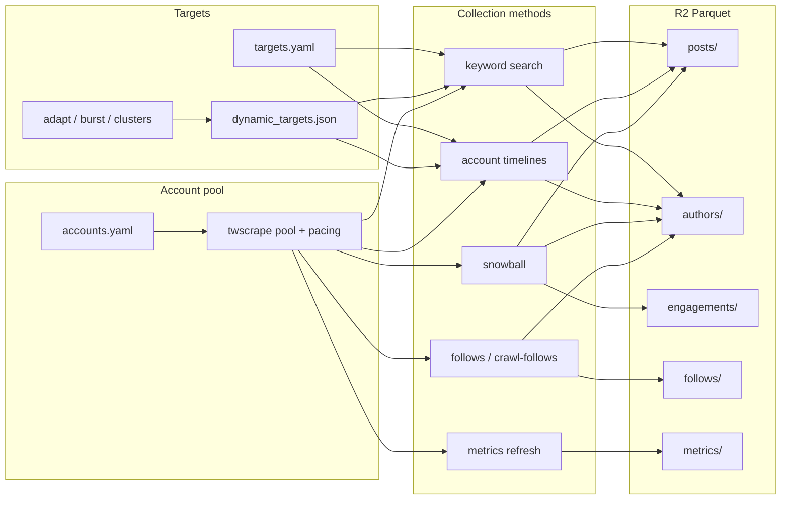

# Collection reference

The collector (`collector/`, CLI `monitor`) scrapes X (Twitter) via a rotating
twscrape account pool and writes immutable Parquet runs to Cloudflare R2. Analysis
reads the same prefixes with DuckDB (`analysis/`, `kma.db`).

Production runs on **pi0** (Docker, residential egress + optional tf1 HTTP
proxies). See [CIB-oriented strategy](cib-collection.md) for why each method
exists in the coordination-detection pipeline.

## Architecture



**Sampling caveat:** search and timelines are a *sample*, not a census. Absence of
a co-action in the data is not evidence of absence. Snowball retweeter lists and
follow-graph crawls deliberately densify behaviour around hot or suspicious
accounts.

## R2 layout

Immutable Hive-partitioned Parquet; one file per run. Dedup and "latest state"
are done in SQL at read time (`QUALIFY row_number() ... ORDER BY collected_at DESC`).

```
r2://kenya-monitor-2027/
  posts/platform=x/type=search/dt=YYYY-MM-DD/run=<utc-ts>.parquet
  posts/platform=x/type=timeline/dt=...
  posts/platform=x/type=replies/dt=...          # snowball reply threads
  posts/platform=x/type=hydrated/dt=...       # referenced originals
  authors/platform=x/dt=.../run=...
  metrics/platform=x/dt=.../run=...
  engagements/platform=x/dt=.../run=...       # retweeter incidence (untimed)
  follows/platform=x/dt=.../run=...           # follower_id, followed_id
  coordination/platform=x/kind=.../dt=...     # written by analysis, read by adapt
```

Post rows carry text, engagement counts, hashtags, urls, mentions, reply/repost
metadata, and author snapshots. Author rows carry profile fields used by Phase 1
authenticity scoring.

## Scheduled worker (`monitor run`)

The default Docker entrypoint. One asyncio scheduler coordinates:

| Job | Cadence | What it runs |
|-----|---------|--------------|
| **posts** | every 3-5h (scales with pool size) | `run_once` + `snowball` |
| **metrics** | ~midpoint between post gaps | `run_metrics_once` |
| **burst** | every 30 min (check only) | extra posts + snowball if volume spikes |
| **accounts** | every 6h | sync yaml pool, relogin failures, reset locks |

Each **posts** pass:

1. Merges static `config/targets.yaml` with live `state/dynamic_targets.json`
   (hashtag bursts + coordination-cluster accounts).
2. Sweeps **recent search windows** (`SEARCH_RECENT_DAYS`, default 2 calendar days).
3. Once per UTC day, adds **older backfill windows** (`SEARCH_BACKFILL_WINDOW_DAYS`).
4. Fetches **account timelines** for configured + promoted accounts.
5. Runs a **snowball** pass on hot objects from the last few days.

Posts and metrics share the account pool but only one posts pass holds the lock
at a time. twscrape rotates accounts LRU-style; per-account pacing applies between
requests (`REQUEST_DELAY_MIN` / `REQUEST_DELAY_MAX`).

**Not scheduled automatically:** `follows`, `crawl-follows`, `backfill`, `adapt`
(dry-run only in scheduler path). Run these manually or via cron on pi0.

---

## Collection methods

### 1. Keyword search

**Purpose:** Sample discourse around election keywords and promoted hashtags.

**How it works:**

- Builds X search queries from `config/targets.yaml` keywords + dynamic promotions.
- Uses **Latest** product (chronological, not relevance-ranked).
- Appends `include:nativeretweets` so low-engagement retweets are captured with
  real `created_at` (feeds timed co-share analysis).
- Sweeps daily `(since, until)` windows; `SEARCH_MIN_FAVES` optional engagement floor.
- Up to `COLLECT_CONCURRENCY` keywords in parallel.

**CLI:** `monitor collect x --keywords` or `monitor run --once`

**Writes:** `posts/type=search`, `authors/`

**Key env:** `SEARCH_PRODUCT`, `SEARCH_INCLUDE_RETWEETS`, `SEARCH_RECENT_DAYS`,
`SEARCH_WINDOW_LIMIT`, `SEARCH_MIN_FAVES`, `COLLECT_CONCURRENCY`

---

### 2. Account timelines

**Purpose:** Dense sampling of specific accounts (politicians, media, promoted
cluster members).

**How it works:**

- Fetches recent tweets per handle via user timeline API.
- Same author snapshot drain as search.

**CLI:** `monitor collect x --accounts` (included in `monitor run`)

**Writes:** `posts/type=timeline`, `authors/`

---

### 3. Historical backfill

**Purpose:** One-shot depth pass to even out temporal coverage after pipeline
changes or keyword expansion.

**How it works:**

- Daily windows across the last N days (`--days`, default 14).
- Per-keyword resumable writes.

**CLI:** `monitor backfill --days 14 --limit 20`

**Writes:** `posts/type=search`, `authors/`

---

### 4. Metrics refresh

**Purpose:** Track engagement growth on already-collected posts (likes, reposts,
quotes, views over time).

**How it works:**

- DuckDB query: top `top_pct` (default 5%) of posts in the last `days` by
  likes + quotes + reposts.
- Cap scales with active account pool (`METRICS_MAX_POSTS_PER_ACCOUNT`).

**CLI:** `monitor metrics --days 5 --top-pct 0.05`

**Writes:** `metrics/` (snapshots keyed by `platform_post_id`)

**Scheduled:** yes, between post collection gaps.

---

### 5. Snowball / object census

**Purpose:** Densify behavioural evidence around *shared objects* (tweets,
conversations) for coordination detection. Keyword search alone under-samples
co-retweet structure.

**How it works (per pass, on hot objects in R2):**

| Step | Picks | Fetches | Writes |
|------|-------|---------|--------|
| Retweeter census | top reposted tweet IDs (`SNOWBALL_TOP_RETWEETED`) | `retweeters()` per object | `engagements/` (kind=retweet) + authors |
| Reply threads | top conversations by `reply_count` | `replies()` per root | `posts/type=replies` |
| Hydration | referenced IDs not yet in corpus | `hydrate()` by id | `posts/type=hydrated` |

`state/snowball.json` TTLs each object (`SNOWBALL_REFRESH_HOURS`, default 12h) so
hot tweets are re-censused without hammering every pass.

Retweeter rows have **no retweet timestamp** (platform limitation): they feed the
*untimed* co-retweet channel. Timed co-share uses RT rows from search.

**CLI:** `monitor snowball`

**Writes:** `engagements/`, `posts/type=replies`, `posts/type=hydrated`, `authors/`

**Scheduled:** after every posts pass (+ on burst trigger).

**Analysis:** `kma.coordination.traces("co_retweet")` unions engagements with
post-derived retweets.

---

### 6. Adaptive target promotion

**Purpose:** Close the analysis-to-collection loop without editing curated targets.

**How it works:**

`state/dynamic_targets.json` holds promoted entries merged at runtime with
`targets.yaml` (never written back to yaml).

| Source | Rule | Promoted as |
|--------|------|-------------|
| Hashtag burst | 24h count >= floor AND >= ratio x 7d daily avg (or new tag) | keyword |
| Coordination cluster | member of latest `coordination/kind=clusters` run on R2 | account timeline target |

Caps: `DYNAMIC_MAX_KEYWORDS`, `DYNAMIC_MAX_ACCOUNTS`. Entries expire after
`DYNAMIC_EXPIRY_DAYS` without re-confirmation.

**CLI:** `monitor adapt` (use `--dry-run` to preview)

**State:** `state/dynamic_targets.json`

**Scheduled:** promotion runs inside `_adaptive_targets()` before each posts pass.

---

### 7. Burst-triggered sweeps

**Purpose:** Catch fast co-ordinated bursts that fall between 3-5h post gaps.

**How it works:**

- Every 30 min: compare last complete hour's post count to prior 48h mean/std.
- If z >= `BURST_ZSCORE` and count >= `BURST_MIN_POSTS`: immediate posts + snowball
  (at most once per hour bucket).

**CLI:** automatic under `monitor run` (no separate command)

---

### 8. Follow edges (one-shot)

**Purpose:** Fetch follower/following lists for targeted accounts (graph
corroboration, follower-overlap signals).

**How it works:**

- For each handle: `followers()` + `following()` up to `FOLLOW_FETCH_LIMIT` per
  direction.
- Writes directed edges `(follower_id, followed_id)`.
- Author snapshots for discovered users.

**Target selection (first match):**

1. `--handle` (explicit, repeatable)
2. `--top-suspicious N` (heuristic suspicion rank from R2 authors/posts; see
   `kenya_monitor.suspicion`)
3. Default: members of latest persisted coordination clusters

**CLI:**

```bash
monitor follows --handle suspect1 --limit 200
monitor follows --top-suspicious 100
monitor follows                              # cluster members, cap 30
```

**Writes:** `follows/`, `authors/`

**Key env:** `FOLLOW_FETCH_LIMIT` (500), `FOLLOW_MAX_ACCOUNTS` (30)

---

### 9. Recursive follow crawl

**Purpose:** Walk the social graph BFS: followers lead to follows, enqueue
untracked accounts, repeat across runs.

**How it works:**

1. **Seeds:** `--handle`, `--top-suspicious`, and/or uncrawled accounts already
   appearing in `follows/` edges (unless `--no-edges`).
2. For each account due for crawl: fetch follower/following lists, write edges.
3. Enqueue newly discovered accounts from edge endpoints (must have known handle
   from author snapshots).
4. Skip accounts crawled within `FOLLOW_CRAWL_REFRESH_DAYS` (default 30).
5. **Checkpoint** state after every account (resumable).

**Crawl ledger:** `state/follow_crawl.json`

```json
{
  "updated_at": "2026-07-08T12:00:00+00:00",
  "entries": {
    "1799415949684043776": {
      "handle": "example",
      "crawled_at": "2026-07-08T11:39:04+00:00",
      "edge_count": 263,
      "status": "ok"
    }
  }
}
```

`status`: `ok` | `failed` (retried next run).

**CLI:**

```bash
monitor crawl-follows --status
monitor crawl-follows --top-suspicious 50 --max-accounts 50
monitor crawl-follows --handle seed1 --refresh-days 14 --limit 200
```

**Writes:** `follows/`, `authors/` (one parquet run per crawled account)

**Key env:** `FOLLOW_CRAWL_MAX_PER_RUN` (50), `FOLLOW_CRAWL_REFRESH_DAYS` (30),
`FOLLOW_CRAWL_STATE_PATH`

**Typical ops:** cron every few hours; each invocation crawls up to
`FOLLOW_CRAWL_MAX_PER_RUN` new/stale accounts and expands the queue.

---

### 10. Account pool

**Purpose:** Rotate many X scraping accounts without burning them.

**How it works:**

- `config/accounts.yaml`: credentials, cookies, per-account HTTP proxies.
- Synced into twscrape SQLite pool (`state/accounts.db`).
- LRU rotation (`TWS_ACCOUNT_ORDER`), per-account request pacing, periodic relogin.

**CLI:**

```bash
monitor accounts add      # initial load + login
monitor accounts sync     # refresh cookies/proxies, relogin failures
monitor accounts stats    # health + rotation order
monitor accounts list
```

---

## Observability

| Command | Purpose |
|---------|---------|
| `monitor check` | R2 auth + round-trip write/read |
| `monitor stats` | Total + recent volume by prefix (posts, authors, metrics, engagements, follows) |
| `monitor targets` | Static yaml targets |
| `monitor query "SELECT ... FROM {posts}"` | Ad-hoc DuckDB over R2 |

Example:

```bash
monitor stats --hours 24 --days 7
```

---

## Configuration reference

Grouped env vars (defaults in `kenya_monitor.config`). Set in repo root `.env`.

### Search and posts

| Variable | Default | Description |
|----------|---------|-------------|
| `SEARCH_PRODUCT` | `Latest` | X search ordering |
| `SEARCH_INCLUDE_RETWEETS` | on | Native retweets in search |
| `SEARCH_RECENT_DAYS` | 2 | Daily windows per posts pass |
| `SEARCH_BACKFILL_WINDOW_DAYS` | 2 | Extra older windows (once/day) |
| `SEARCH_WINDOW_LIMIT` | 20 | Max posts per keyword per window |
| `SEARCH_MIN_FAVES` | 0 | Engagement floor in query |
| `COLLECT_CONCURRENCY` | 3 | Parallel keyword workers |

### Scheduler / pool

| Variable | Default | Description |
|----------|---------|-------------|
| `POSTS_MIN_GAP_HOURS` | 3 | Min gap between post passes |
| `POSTS_MAX_GAP_HOURS` | 5 | Max gap between post passes |
| `ACCOUNT_SYNC_HOURS` | 6 | Pool maintenance interval |
| `TWS_ACCOUNT_ORDER` | LRU SQL | twscrape account rotation |
| `REQUEST_DELAY_MIN` / `MAX` | (pacing) | Per-account delay between requests |
| `METRICS_MAX_POSTS_PER_ACCOUNT` | 8 | Metrics cap scaling |
| `METRICS_MAX_POSTS_FLOOR` | 200 | Metrics cap floor |

### Snowball

| Variable | Default | Description |
|----------|---------|-------------|
| `SNOWBALL_TOP_RETWEETED` | 15 | Hot reposted objects |
| `SNOWBALL_TOP_CONVERSATIONS` | 10 | Hot reply threads |
| `SNOWBALL_RETWEETERS_LIMIT` | 300 | Max retweeters per object |
| `SNOWBALL_REPLIES_LIMIT` | 150 | Max replies per thread |
| `SNOWBALL_HYDRATE_LIMIT` | 50 | Max hydrated originals |
| `SNOWBALL_LOOKBACK_DAYS` | 2 | Hot-object lookback |
| `SNOWBALL_REFRESH_HOURS` | 12 | Per-object re-fetch TTL |

### Adaptive promotion

| Variable | Default | Description |
|----------|---------|-------------|
| `DYNAMIC_MAX_KEYWORDS` | 10 | Cap promoted hashtags |
| `DYNAMIC_MAX_ACCOUNTS` | 20 | Cap promoted accounts |
| `DYNAMIC_EXPIRY_DAYS` | 7 | Drop stale promotions |
| `DYNAMIC_HASHTAG_MIN_COUNT` | 20 | 24h hashtag floor |
| `DYNAMIC_HASHTAG_RATIO` | 5.0 | Burst ratio vs 7d avg |
| `BURST_ZSCORE` | 3.0 | Volume spike threshold |
| `BURST_MIN_POSTS` | 100 | Hourly floor for burst |

### Follow graph

| Variable | Default | Description |
|----------|---------|-------------|
| `FOLLOW_FETCH_LIMIT` | 500 | Edges per direction per account |
| `FOLLOW_MAX_ACCOUNTS` | 30 | One-shot `follows` cap |
| `FOLLOW_CRAWL_MAX_PER_RUN` | 50 | Accounts per `crawl-follows` invocation |
| `FOLLOW_CRAWL_REFRESH_DAYS` | 30 | Re-crawl TTL |
| `FOLLOW_CRAWL_STATE_PATH` | `state/follow_crawl.json` | Crawl ledger |

### State file paths

| Variable | Default |
|----------|---------|
| `DYNAMIC_TARGETS_PATH` | `state/dynamic_targets.json` |
| `SNOWBALL_STATE_PATH` | `state/snowball.json` |
| `FOLLOW_CRAWL_STATE_PATH` | `state/follow_crawl.json` |

---

## Suggested operational workflows

**Daily monitoring (automatic):** `monitor run` in Docker on pi0.

**After analysis publishes clusters:** `monitor adapt` then timelines pick up
cluster members on the next posts pass.

**Graph expansion:**

```bash
monitor crawl-follows --top-suspicious 100 --max-accounts 50   # repeat via cron
monitor crawl-follows --status
```

**Deep suspicion sweep (one-shot):**

```bash
monitor follows --top-suspicious 1000 --max-accounts 1000 --limit 200
```

**Volume check:**

```bash
monitor stats
```

---

## Analysis integration

| R2 prefix | Analysis entrypoint |
|-----------|---------------------|
| `posts/` | `kma.db.posts_source`, notebooks |
| `authors/` | `kma.authenticity.authenticity_score` |
| `engagements/` | `kma.coordination.traces("co_retweet")` |
| `follows/` | `kma.db.latest_follows` (follower overlap) |
| `metrics/` | engagement trajectories in `explore` notebook |
| `coordination/` | `monitor adapt`, cluster-aware collection |

Further reading: [Phase 3 data and traces](../analysis/phase-3/01-data-and-traces.md),
[CIB collection strategy](cib-collection.md).
